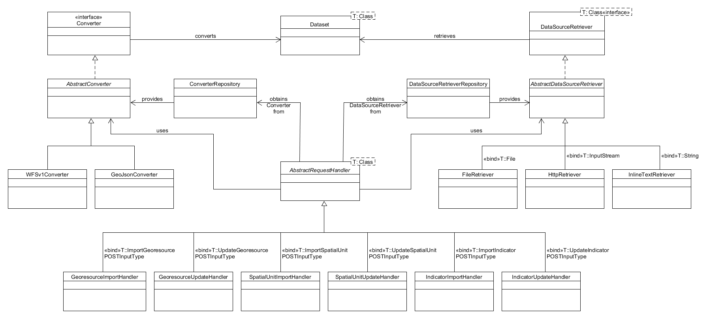

# KomMonitor Importer

This project implements a webapp that enables the import of spatial datasets (_SpatialUnits_, _Georesources_ and _Indicators_) 
into the _KomMonitor Spatial Data Infrastructure_. The webapp provides an API for retrieving data from various data sources 
that come in the shape of certain formats and converting the datasets into a KomMonitor related schema. The converted 
datasets come available within the KomMonitor Spatial Data Infrastructure by publishing them via the _Data Management API_.

## Quick Links And Further Information on KomMonitor
   - [DockerHub repositories of KomMonitor Stack](https://hub.docker.com/orgs/kommonitor/repositories)
   - [Github Repositories of KomMonitor Stack](https://github.com/KomMonitor)
   - [Github Wiki for KomMonitor Guidance and central Documentation](https://github.com/KomMonitor/KomMonitor-Docs/wiki)
   - [Technical Guidance](https://github.com/KomMonitor/KomMonitor-Docs/wiki/Technische-Dokumentation) and [Deployment Information](https://github.com/KomMonitor/KomMonitor-Docs/wiki/Setup-Guide) for complete KomMonitor stack on Github Wiki
   - [KomMonitor Website](https://kommonitor.de/)  

## Dependencies to other KomMonitor Components
KomMonitor Importer requires 
   - a running instance of **KomMonitor Data Management**, to forward any import/update requests.
   - an optional and configurable connection to a running **Keycloak** server, if role-based data access is activated via configuration of KomMonitor stack


# Project Structure

The KomMonitor Importer project comprises different modules that encapsulate different tasks:  

## [KomMonitor Importer Models](https://github.com/SebaDro/kommonitor-importer/tree/master/kommonitor-importer-models)  
This module contains the API model classes which will be used for serialization and deserialization of JSON payload for 
API calls via [Jackson annotations](https://github.com/FasterXML/jackson-annotations). The model classes were auto-generated
from the [KomMonitor Importer OpenAPI specs](https://gitlab.fbg-hsbo.de/kommonitor/kommonitor-api-specs/tree/master/src/specs/data-importer)
by the use of [Swagger Codegen](https://github.com/swagger-api/swagger-codegen).

## [KomMonitor Importer Core](https://github.com/SebaDro/kommonitor-importer/tree/master/kommonitor-importer-core)  
The core module provides the main data entities that represent KomMonitor related resources as well as classes that are
responsible for importing datasets. In particular, these are: 
* _DataSourceRetriever_ implementations for fetching datasets
 from a certain datasource  
 (package: _org.n52.kommonitor.importer.io.datasource_)
* _Converter_ implementations that supports the conversion certain data formats  
(package: _org.n52.kommonitor.importer.converter_).  

The above mentioned packages also provide interfaces that can be implemented to extend the project by additional 
datasource retriever and converters (see: [Extend the Importer API](#extend-the-importer-api)).
 
In addition, the module contains some helper and service classes for:
* performing HTPP requests 
* storing uploaded files
* performing common geometrical operations
* dealing with the GeoTools [Feature model](https://docs.geotools.org/latest/userguide/library/opengis/feature.html) for
decoding properties and geometries  

## [KomMonitor Importer API](https://github.com/SebaDro/kommonitor-importer/tree/master/kommonitor-importer-api)  
The API module primarily comprises three kinds of classes that are responsible for implementing the API endpoints:
* _API_ interfaces contain request mappings for all API endpoints that are defined by 
[Spring MVC](https://docs.spring.io/spring/docs/current/spring-framework-reference/web.html#mvc) annotations as well
as [Swagger Annotations](https://github.com/swagger-api/swagger-core/wiki/Annotations-1.5.X) for generating API
documentations  
(package: _org.n52.kommonitor.importer.api_)
* _Controller_ classes, which are annotated with _@Controller_ for enabling Spring's autodetection, implement the API interfaces
(package: _org.n52.kommonitor.importer.api_)
* _Handler_ classes are be used by the Controllers, to delegate the request handling dependent on a particular request  
(package: _org.n52.kommonitor.importer.api.handler_)

Just like the API model classes, the API interfaces were auto-generated from the
[KomMonitor Importer OpenAPI specs](https://gitlab.fbg-hsbo.de/kommonitor/kommonitor-api-specs/tree/master/src/specs/data-importer) 
by the use of [Swagger Codegen](https://github.com/swagger-api/swagger-codegen).

## [KomMonitor API Client](https://github.com/SebaDro/kommonitor-importer/tree/master/kommonitor-importer-api-client)  
This module provides API clients for the _Data Management API_ endpoints. The client implementation is based on 
[Spring RestTemplate](https://docs.spring.io/spring/docs/current/spring-framework-reference/integration.html#rest-resttemplate)
and was generated from the [KomMonitor Data Management OpenAPI specs](https://gitlab.fbg-hsbo.de/kommonitor/kommonitor-api-specs/tree/master/src/specs/data-management)
via [Swagger Codegen](https://github.com/swagger-api/swagger-codegen). In addition, End-to-End tests for some of the 
client methods, that are required for the Importer, have been implemented using
[Spring MockRestServiceServer](https://docs.spring.io/spring/docs/current/spring-framework-reference/testing.html#spring-mvc-test-client).  

## [KomMonitor Importer App](https://github.com/SebaDro/kommonitor-importer/tree/master/kommonitor-importer-app)
The App module contains the main class that is responsible for launching the Spring Boot application and an `application.yml`
that provides different properties for externalized configuration. Furthermore, some configuration classes are located 
in the module, that utilize `application.yml` properties for configuring different Spring Beans that will be injected
within the other modules.  

# Installation
## Build from Source
There are some requirements on your building environment in order to build and run the KomMonitor Importer API from source:
* at least Java SE Development Kit 8 must be available
* to build the project from source, [Maven](https://maven.apache.org/index.html) is required
* for cloning the repository, [Git](https://git-scm.com/) must be installed
* if you wish to run the application as Docker container, you also need [Docker](https://www.docker.com/)

You can download the latest branch directly from GitHub or if you have installed Git in your environment just run 
`git clone https://github.com/SebaDro/kommonitor-importer.git`.

After cloning the repository, just run `mvn clean install` from the repository's root directory to build the whole
project from source.

## Configuration
KomMonitor Importer API is a Spring Boot application and provides a `application.yml` within the 
[KomMonitor Importer App module](https://github.com/SebaDro/kommonitor-importer/tree/master/kommonitor-importer-app) for
externalized configurations. The properties within this file can be used to configure the application. A documentation
for common application properties can be found under https://docs.spring.io/spring-boot/docs/current/reference/html/appendix-application-properties.html  
  
Furthermore, the `application.yml` contains some additional and custom configuration properties:
* `kommonitor.importer.datamanagement-api-url:`: endpoint of the KomMonitor Data Management API
* `kommonitor.importer.fileStorageLocation`: path to the file storage directory that will be used for storing uploaded files
* `springfox.documentation.swagger.v2.path`: defines the default context path for retrieving the API documentation

## Start the Application
There are different deployment patterns for running the application:  
### JAR  
If you have built the project from source, the KomMonitor Importer App has been packaged as JAR artifact. So, just execute
execute the JAR within the target folder of the `kommonitor-importer-app` module to run the application.
### Maven
You can also start the application by running `mvn spring-boot:run` from the root
of the `kommonitor-importer-app` module.
### Docker
The repository also contains a Dockerfile for building a Docker image of the application. To build the image,
run `docker build -t kommonitor/importer:latest .` from the root of the repository. Finally, a container with published
port 8087 can be started with `docker run -p 8087:8087 kommonitor/importer`.
 
By default, the started application is available under http://localhost:8087.

## Exemplar docker-compose File with explanatory comments

Only contains subset of whole KomMonitor stack to focus on the config parameters of this component

```yml

version: '2.1'

networks:
  kommonitor:
    driver: bridge
services:

    # importer component that can import spatial resources from different data sources (e.g. GeoJSON, CSV, WFS), 
    # sanity-check them and forward data integration requests to data management component
    kommonitor-importer:
      image: 'kommonitor/importer'
      container_name: kommonitor-importer
      #restart: unless-stopped
      ports:
        - 8087:8087
      volumes:
       - importer_data:/tmp/importer      # storage location where to store "uploaded files"; files can be uploaded to importer, but currently will never be deleted; hence manually delete them if required
      environment:
       - kommonitor.importer.datamanagement-api-url=http://kommonitor-data-management:8085/management   # target URL to running Data Management component ending with "/management" (/management is internal base path of data management component)- best use docker name and port within same network
       - JAVA_OPTS=-Dorg.geotools.referencing.forceXY=true       # important setting that coordinate system axes shall follow order XY (default is YX, but KomMonitor Data Management component expects axis order XY; e.g. longitude, latitude)
       - logging.level.org.n52.kommonitor=ERROR         # adjust logging level [e.g. "INFO", "WARN", "ERROR"] - ERROR logs only errors 
       - KOMMONITOR_SWAGGERUI_BASEPATH=        #depending on DNS Routing and Reverse Proxy setup a base path can be set here to access swagger-ui interface (e.g. set '/data-importer' if https://kommonitor-url.de/data-importer works as entry point for localhost:8087)   
       - KOMMONITOR_SWAGGER_UI_SECURITY_CLIENT_ID=kommonitor-importer   # client/resource id of importer component in Keycloak realm
       - KOMMONITOR_SWAGGER_UI_SECURITY_SECRET=secret                   # WARNING: DO NOT SET IN PRODUCTION!!! Keycloak secret of this component within Credentials tab of respective Keycloak client; secret for swagger-ui to authorize swagger-ui requests in a Keycloak-active scenario (mostly this should not be set, as users with access to swagger-ui (e.g. 'http://localhost:8087/swagger-ui.html') could then authorize without own user account and perform CRUD requests)
       - KEYCLOAK_ENABLED=false                                       # enable/disable role-based data access using Keycloak (true requires working Keycloak Setup and enforces that all other components must be configured to enable Keycloak as well)
       - KEYCLOAK_AUTH_SERVER_URL=https://keycloak.fbg-hsbo.de/auth   # Keycloak URL ending with '/auth/'
       - KEYCLOAK_REALM=kommonitor                                    # Keycloak realm name
       - KEYCLOAK_RESOURCE=kommonitor-importer                        # client/resource id of importer component in Keycloak realm
       - KEYCLOAK_CREDENTIALS_SECRET=secret                           # Keycloak secret of this component within Credentials tab of respective Keycloak client; must be set here
       - SERVER_PORT=8087                                             # Server port; default is 8087
      networks:
       - kommonitor


    # database container; must use PostGIS database
    # database is not required to run in docker - will be configured in Data Management component
    kommonitor-db:
      image: mdillon/postgis
      container_name: kommonitor-db
      #restart: unless-stopped
      ports:
        - 5432:5432
      environment:
        - POSTGRES_USER=kommonitor      # database user (will be created on startup if not exists) - same settings in data management service
        - POSTGRES_PASSWORD=kommonitor  # database password (will be created on startup if not exists) - same settings in data management service 
        - POSTGRES_DB=kommonitor_data   # database name (will be created on startup if not exists) - same settings in data management service
      volumes:
        - postgres_data:/var/lib/postgresql/data   # persist database data on disk (crucial for compose down calls to let data survive)
      networks:
        - kommonitor

    # Data Management component encapsulating the database access and management as REST service
    kommonitor-data-management:
      image: kommonitor/data-management
      container_name: kommonitor-data-management
      #restart: unless-stopped
      depends_on:
        - kommonitor-db    # only if database runs as docker container as well
      ports:
        - "8085:8085"
      networks:
        - kommonitor
      links:
        - kommonitor-db
      environment:
      # - env parameters omitted here for brevity


volumes:
 postgres_data:
 importer_data:


```


# User Guide
## Interact with the API
The entrypoint for the KomMonitor Importer API is http://localhost:8087. If you call this URL without any additional endpoint,
you will be redirected to  http://localhost:8087/swagger-ui.html. This page provides a Swagger UI, which has been generated
from the OpenAPI specification for visualization and interacting with the API resources. So, feel free to try out the
different API endpoints via Swagger UI to get started.

## Supported Data Source Types
The Importer API supports selected data source types. For each type, the application contains an appropriate implementation
that is responsible for accessing the data source and retrieving datasets from it. The API has two endpoints for retrieving
information about the supported data source types:
* `/datasourceTypes`: lists all supported types of a data source
* `datasourceTypes/{type}`: provides detailed information and supported parameters for a certain data source type  

## Supported Data Formats
Retrieving datasets from a certain data source is only one aspect the Importer API has to deal with. Another one is the
ability for parsing the dataset in order to map it to a format the Data Management API can deal with. Hence, the API
provides different converters, each one supporting a certain data format. You will find information about the available
converters via the following endpoints:
* `/converters`: lists all available converters and its supported data formats
* `/converters/{name}`: provides detailed information and supported parameters for a certain converter

## File Upload
If you plan to import a dataset that is stored within a file, you first have to upload this file to the server so that
it gets accessible for the data source retriever.  

The upload is done by performing a POST request with a multi-part message that contains the file against the `/upload` endpoint.
Optionally, you can set a custom file name within the multi-part message that will be used for storing the file on the server.  

You can retrieve a list of all ever uploaded files by doing a GET request on the `/upload` endpoint.

## Import Datasets
For each resource type of the KomMonitor DataManagement API (_Georesources_, _Spatial Units_, _Indicators_), the Importer API
provides an appropriate endpoint that triggers the import process. Within the POST body of an import request you have to
define some required information about how to access a certain dataset and how to convert it into the KomMonitor specific schema.

### Import Georesources
You can trigger the import of _Georesources_ by sending a POST request to the `/georesources` endpoint. The request body
has to contain the following properties:
* `georesourcePostBody`: A JSON object in accordance to the POST request body for the `/georesources` endpoint of the
Data Management API. Only the `geoJsonString` property must not be set, since its value will be generated as part of the
import process. For all other properties, you can find detailed descriptions in the Data Management API documentation.
* `datasource`: Definition of the data source from which new datasets should be imported   
(see: [Datasource Definition](#datasource-definition)).
* `converter`: Definition of the converter that should be used for converting the imported dataset  
(see: [Converter Definition](#converter-definition)).
* `propertyMapping`: Definitions for mapping properties from the imported dataset to required properties for spatial resources  
(see: [Spatial Resource Property Mapping](#spatial-resource-property-mapping)).
* `dryRun`: Indicates if a dry run import should be performed. If `true` the import process will be performed without posting
the imported resources to the Data Management API. You should perform a dry run in order to get a preview of those
resources that would be imported and possible errors that occur during the import. 

### Import Spatial Units
The import of Spatial Units is done by sending a POST request to the `/spatial-units` endpoint. The request body
has to contain the following properties:
* `spatialUnitPostBody`: A JSON object in accordance to the POST request body for the `/spatialUnits` endpoint of the
Data Management API. Only the `geoJsonString` property must not be set, since its value will be generated as part of the
import process. For all other properties, you can find detailed descriptions in the Data Management API documentation.
* `datasource`: Definition of the data source from which new datasets should be imported  
(see: [Datasource Definition](#datasource-definition)).
* `converter`: Definition of the converter that should be used for converting the imported dataset  
(see: [Converter Definition](#converter-definition)).
* `propertyMapping`: Definitions for mapping properties from the imported dataset to required properties for spatial resources  
(see: [Spatial Resource Property Mapping](#spatial-resource-property-mapping)).
* `dryRun`: Indicates if a dry run import should be performed. If `true` the import process will be performed without posting
the imported resources to the Data Management API. You should perform a dry run in order to get a preview of those
resources that would be imported and possible errors that occur during the import. 

### Import Indicators
For importing an _Indicator_ you have to perform a POST request to the `/indicators` endpoint. The request body
has to contain the following properties:
* `indicatorPostBody`: A JSON object in accordance to the POST request body for the `/indicators` endpoint of the
Data Management API. Only the `indicatorValues` property must not be set, since the time series values will be generated 
as part of the import process. For all other properties, you can find detailed descriptions in the Data Management API documentation.
* `datasource`: Definition of the data source from which new datasets should be imported  
(see: [Datasource Definition](#datasource-definition)).
* `converter`: Definition of the converter that should be used for converting the imported dataset  
(see: [Converter Definition](#converter-definition)).
* `propertyMapping`: Definitions for mapping properties from the imported dataset to required properties for _Indicators_  
(see: [Indicator Property Mapping](#indicator-property-mapping)).
* `dryRun`: Indicates if a dry run import should be performed. If `true` the import process will be performed without posting
the imported resources to the Data Management API. You should perform a dry run in order to get a preview of those
resources that would be imported and possible errors that occur during the import. 

### Import response
The response body for a successful import request contains the following parameters:  
* `uri`: If the imported resources were inserted into the _Data Management API_ successfully, this is the uri of the resource.
Note, that the `uri` parameter won't be included for a dry run.
* `importedFeatures`: The IDs of all imported resources are included in this array.
* `errors`: The messages for all errors, that occur during the import, will be listed within this parameter.  

Below listed, you'll find an example for such a response:
```json
{
    "uri": "00b462d7-8903-40e9-8222-10f534afcbb6",
    "importedFeatures": [
        "_170",
        "_152",
        "_638"
    ],
    "errors": [
        "Failed conversion for resource _312. Cause(s): [Property 'dmg_altrstr_drchschnaltr' does not exist.]"
    ]
}
```

### Import Definitions
As you can see from the above sections, you have to declare various properties within the request body that are required
for performing the import. The following sections give you some examples of how to define those properties.
#### Datasource Definition
The `dataSource` property is required within the POST request body for each resource endpoint. It contains information
about the data source type and additional parameters that are required for fetching datasets from it. You'll get an information
of all supported data source types from the `/datasourceTypes` endpoint (see: [Supported Data Source Types](#supported-data-source-types)).
As an example, the following snipped shows how to define a HTTP datasource with a URL parameter that will be used for performing a
HTTP GET request: 
```json
{
  "dataSource": {
    "type": "HTTP",
    "parameters": [
      {
        "name": "URL",
        "value": "http://www.webgis-server.de/endpoint?SERVICE=WFS&REQUEST=getFeature&VERSION=1.1.0&TypeName=ns0:testType"
      }
    ]
  }
}
```
#### Converter Definition
The `converter` property is another mandatory property that has to be defined within the POST request body. It contains
configurations for the converter that should be used for importing a dataset. Ideally, you choose a converter appropriate to
the dataset's format. The `/converters` endpoints provides a list of all available converter implementations and its
supported properties like encoding, mimeType, schema and additional properties.
Following, you'll find an example for a converter configuration according to a dataset that comes in the shape of a WFS 1.0.0
schema:
```json
{
  "converter": {
    "name": "org.n52.kommonitor.importer.converter.wfs.v1",
    "encoding": "UTF-8",
    "mimeType": "application/xml",
    "schema": "http://schemas.opengis.net/wfs/1.0.0/wfs.xsd",
    "parameters": [
      {
        "name": "CRS",
        "value": "EPSG:25832"
      }
    ]
  }
}
```
If you wish to get some additional information about the WFS 1.0.0 converter, feel free to call its API endpoint 
`/converters/org.n52.kommonitor.importer.converter.wfs.v1`. You will notice, that the converter supports multiple schemas 
and in addition a `CRS` parameter to define the coordinate reference system of the dataset to import. Make sure, you'll know
both in order to define the converter properly for the import request.

#### Spatial Resource Property Mapping
As part of the import process, a GeoJSON FeatureCollection will be generated from the imported dataset, that will be used
for adding new resources via the Data Management API. This FeatureCollection contains the geometry from the imported dataset, 
some additional properties, according to the Data Management API schema for those resources and optional a the whole
collection of feature attributes or only a subset from it. To tell the Import API which properties from the original 
dataset should be used for the FeatureCollcetion properties, a property mapping has to be provided. E.g. assume the 
following GeoJSON dataset:
```json
{
	"type": "FeatureCollection",
	"name": "Baubloecke",
	"features": [
		{
			"type": "Feature",
			"properties": {
				"baublock_id": "_170",
				"EreignisintervallStart": "2019-05-06",
				"EreignisintervallEnde": "2019-05-28",
				"altersdurchschnitt": 43.4123,
                "ort": "Musterstadt",
                "plz": "12345"
			},
			"geometry": {
				"type": "MultiPolygon",
				"coordinates": [[[
					[384891.959,5713511.4441],
					[384898.084,5713509.1401],
					[384947.758,5713522.8651],
					[385030.73,5713539.248],
					[384891.959,5713511.4441]
				]]]
			}
		}
	]
} 
```
An appropriate property mapping would be:
```json
{
  "propertyMapping": {
    "identifierProperty": "baublock_id",
	"nameProperty": "baublock_id",
	"validStartDateProperty": "EreignisintervallStart",
	"validEndDateProperty": "EreignisintervallEnde",
    "keepAttributes": false,
    "keepMissingOrNullValueAttributes": false,
    "attributes": [
      {
        "name": "ort",
        "type": "string"
      },
      {
        "name": "plz",
        "mappingName": "postleitzahl",
        "type": "string"
      }     
    ] 
  }
}
```
The first two properties (`identifierProperty` and `nameProperty`) are specified by the Data Management API schema and 
are mandatory.  

The following two properties (`validStartDate` and `validEndDate`) are also specified by the by the Data Management API 
schema but optional.  

The `keepAttributes` property indicates indicates whether to preserve all attributes or not. If true, you can't specify 
an alias for the attributes, like you would do for the attribute mappings.  

You can define mappings for any attributes under the `attributes` property. Here you can also define an alias name 
for an attribute by setting a value for the `mappingName` property. If the `keepAttributes` is true, this property will 
be skipped.  

In addition, you have to specify if you want to keep missing attributes or attributes that hold a NULL value by setting
the `keepMissingOrNullValueAttributes` property. If true, any missing attribute will be added to the converted resource
by setting a NULL value. Attributes that are present but holds a NULL value will be kept anyway. Note, that this property
will be ignored if `keepAttributes` ist set to true, since all present attributes will be kept anyway.

Note, that up to now only flat property hierarchies are supported. Nested properties in the original dataset can't be covered
with the property mapping, so the import will fail for such a dataset.

#### Indicator Property Mapping
The property mapping for _Indicators_ is different to the mapping for spatial features. Since there are different strategies
of how to encode time series values for spatial features, the time series mapping also supports different strategies for mapping
those values, which will be explained in the following.

**Case 1: Related Indicator values for the same time series are encoded within different features**  
In this case, each single _Indicator_ value of the same time series is encoded as a separate feature. In the example below,
there are two features for the same Spatial Unit. Both features have the same ID and also the same geometry. Only the
properties are different, because each feature only contains the properties for a single timestep of a common time series.
```json
{
	"type": "FeatureCollection",
	"name": "Baubloecke",
	"features": [
		{
			"type": "Feature",
			"properties": {
				"baublock_id": "_170",
				"date": "2019-05-06",
				"altersdurchschnitt": 43.4123
			},
			"geometry": { }
		},
		{
			"type": "Feature",
			"properties": {
				"baublock_id": "_170",
				"date": "2020-04-23",
				"altersdurchschnitt": 48.4123
			},
			"geometry": { }
		}
	]
} 
```
For this case, you only have to define a single `timeseriesMapping` beside the mapping for the `spatialReferenceKey`.
If you provide such a mapping to the Import API, the responsible converter automatically tries to group the features
by its' values for the `spatialReferenceKey`, so that it can merge the single _Indicator_ values to a time series for each
spatial feature. Note, that you have to define both, the property that holds the _Indicator_ value and the property that
holds the timestamp information:
```json
{
  "propertyMapping": {
    "spatialReferenceKeyProperty": "baublock_id",
    "keepMissingOrNullValueIndicator": false,
	"timeseriesMappings": [
	  {
	    "indicatorValueProperty": "altersdurchschnitt",
	    "timestampProperty": "date"
	  }
	]
  }
}
```
**Case 2: Each feature contains the whole time series**  
This encoding stratetgy for time series values implies, that a single feature has the complete time series for an _Indicator_
encoded within its properties. For each time step there is a separate property that holds the _Indicator_ value for this 
time step. Like in the example below, the property name may contain the timestamp information for an _Indicator_.
```json
{
	"type": "FeatureCollection",
	"name": "Baubloecke",
	"features": [
		{
			"type": "Feature",
			"properties": {
				"baublock_id": "_170",
				"altersdurchschnitt2019-05-06": 43.4123,
                		"altersdurchschnitt2020-04-23": 48.4123
			},
			"geometry": { }
		}
	]
} 
```
If the time series is encoded in a way like the example above, you have to provide multiple time series mappings. For
each time step you have to define, which property contains the corresponding _Indicator_ value. Note, that in such a case
you have to provide the final timestamp value within the mapping, rather than defining the property that holds the 
timestamp information.
```json
{
  "propertyMapping": {
    "spatialReferenceKeyProperty": "baublock_id",
    "keepMissingOrNullValueIndicator": false,
	"timeseriesMappings": [
	  {
        "indicatorValueProperty": "altersdurchschnitt2019-05-06",
       	"timestamp": "2019-05-06"
      },
	  {
	    "indicatorValueProperty": "altersdurchschnitt2020-04-23",
	    "timestamp": "2020-04-23"
	  }
	]
  }
}
```
Similar to the spatial resouce mapping, you can indicate, if missing indicator values should be kept. This could be useful
if a timeseries is not complete and values are missing for some time steps. Just set `keepMissingOrNullValueIndicator` to
true, so that  missing indicators will be added and indicators with a NULL value will be kept. 

## Update Datasets
The KomMonitor Import API also provides dedicated endpoints for updating existing resources. Just like the simple import,
datasets will be imported from a datasource and converted in an appropriate format. The only difference is, that finally
a PUT request will be performed on the resources endpoint of the Data Management API, in order to update an existing
resource and not creating a new one.

### Update Georesources
The update of _Georesources_ is done by sending a POST request to the `/georesources/update` endpoint. The request body
has to contain the following properties:
* `georesourceId`: The ID of the existing _Georesource_ within the Data Management API
* `georesourcePutBody`: A JSON object in accordance to the PUT request body for the `/georesources` endpoint of the
Data Management API. You can find detailed descriptions in the Data Management API documentation.
* `datasource`: Definition of the data source from which existing datasets should be updated
(see: [Datasource Definition](#datasource-definition)).
* `converter`: Definition of the converter that should be used for converting the imported dataset
(see: [Converter Definition](#converter-definition)).
* `propertyMapping`: Definitions for mapping properties from the imported dataset to required properties for spatial resources.
(see: [Spatial Resource Property Mapping](#spatial-resource-property-mapping)).
* `dryRun`: Indicates if a dry run import should be performed. If `true` the import process will be performed without posting
the imported resources to the Data Management API. You should perform a dry run in order to get a preview of those
resources that would be imported and possible errors that occur during the import. 

### Update Spatial Units
You can update a _Spatial Unit_ by sending a POST request to the `/spatial-units/update` endpoint. The request body
has to contain the following properties:
* `spatialUnitId`: The ID of the existing _SpatialUnit_ within the Data Management API
* `spatialUnitPutBody`: A JSON object in accordance to the PUT request body for the `/spatial-units` endpoint of the
Data Management API. You can find detailed descriptions in the Data Management API documentation.
* `datasource`: Definition of the data source from which existing datasets should be updated
(see: [Datasource Definition](#datasource-definition)).
* `converter`: Definition of the converter that should be used for converting the imported dataset
(see: [Converter Definition](#converter-definition)).
* `propertyMapping`: Definitions for mapping properties from the imported dataset to required properties for spatial resources
(see: [Spatial Resource Property Mapping](#spatial-resource-property-mapping)).
* `dryRun`: Indicates if a dry run import should be performed. If `true` the import process will be performed without posting
the imported resources to the Data Management API. You should perform a dry run in order to get a preview of those
resources that would be imported and possible errors that occur during the import. 

### Update Indicators
If you want to update an _Indicator_, you have to send a POST request to the `/indicators/update` endpoint. The request body
has to contain the following properties:
* `indicatorId`: The ID of the existing _Indicator_ within the Data Management API
* `indicatorPutBody`: A JSON object in accordance to the PUT request body for the `/indicators` endpoint of the
Data Management API. You can find detailed descriptions in the Data Management API documentation.
* `datasource`: Definition of the data source from which existing datasets should be updated
(see: [Datasource Definition](#datasource-definition)).
* `converter`: Definition of the converter that should be used for converting the imported dataset
(see: [Converter Definition](#converter-definition)).
* `propertyMapping`: Definitions for mapping properties from the imported dataset to required properties for _Indicators_
(see: [Indicator Property Mapping](#indicator-property-mapping))
* `dryRun`: Indicates if a dry run import should be performed. If `true` the import process will be performed without posting
the imported resources to the Data Management API. You should perform a dry run in order to get a preview of those
resources that would be imported and possible errors that occur during the import. 

# Extend the Importer API
## Class Diagram
If you want to extend the Importer API, you should have to know about the relevant classes and their relationships with
each other. Therefore, you'll find a simple class diagram below, that shows the most relevant classes:  


**RequestHandler**  
There is one generic `AbstractRequestHandler` that implements a common handling for incoming API requests. Depending on 
the type of the request, a concrete handler implementation handles the request type-specific. E.g. if there is
an incoming request for updating a _SpatialUnit_ the `SpatialUnitUpdateHandler` that is bind on a `UpdateSpatialUnitPOSTInputType`
will be invoked. For importing the requested resource all handler use a certain `DatasourceRetriever` and a certain 
`Converter` that will be provided by repositories.

**DataSourceRetriever**  
Each of the different implementations of the generic `DataSourceRetriever` interface is bound to a certain dataset type and 
is responsible for retrieving a `Dataset` that holds an object of the same type. E.g. the `FileRetriever` retrieves
a `File` and creates a `Dataset` that is bound to the `File` object, while the `HttpRetriever` does the same
with an `InputStream`. Certain `DataSourceRetriever` will be provided to the _RequestHandler_ by the 
`DataSourceRetrieverRepository` dependent on the data source type which is defined by the `dataSource` property within 
the import POST request body (see: [Datasource Definition](#datasource-definition)).

**Converter**  
Certain implementations of the `Converter` interface face the conversion of specific data formats. They take a `Dataset`
which was retrieved by a `DataSourceRetriever` and convert the object that is bound to the `Dataset` into `Indicator`
and `SpatialResource` objects. Those two entity types will be then used to generate the request body for the POST
request against the _Data Management_ API. Like the `DataSourceRetriever`, a certain `Converter` implementation will
be provided by a `ConverterRepository` to the _RequestHandler_, dependent on the `converter` property definition
within the import POST request body (see: [Converter Definition](#converter-definition)).

## How to implement additional DataSourceRetriever
The easiest way to implement a `DataSourceRetriever` for an additional data source is to extend `AbstractDataSourceRetriever`.
Let's have a look on how this could be done by the example of the existing `InlineTextRetriever` which aims to
retrieve data sets that are defined 'inline' within an import POST request body.

1) Annotate your class with the Spring `@Component`, so that it can be auto-injected within the `DataSourceretrieverRepository`
```java
@Component
public class InlineTextRetriever extends AbstractDataSourceRetriever<String> {

}
```
2) Implement `initType()` in order to define a unique type that will be later used to identify the requested `DataSourceRetriever`
and `initSupportedParameters()` for declaring the supported parameters. For the `InlineTextRetriever` only a `payload`
parameter is necessary, so that the dataset can be declared within the import POST request body as _inline_ value
for this property. Note, that for each `DataSourceParameter`, a unique name, a description and a value type
has to be defined.
```java
@Component
public class InlineTextRetriever extends AbstractDataSourceRetriever<String> {

    private static final String TYPE = "INLINE";
    private static final String PARAM_PAYLOAD = "payload";
    private static final String PARAM_PAYLOAD_DESC = "The payload as plain text";

    @Override
    protected String initType() {
        return TYPE;
    }

    @Override
    protected Set<DataSourceParameter> initSupportedParameters() {
        Set<DataSourceParameter> parameters = new HashSet<>();
        DataSourceParameter payloadParam = new DataSourceParameter(PARAM_PAYLOAD, PARAM_PAYLOAD_DESC, DataSourceParameter.ParameterTypeValues.STRING);
        parameters.add(payloadParam);
        return parameters;
    }
    ...
}
```
3) Implement `retrieveDataset()` that should finally provide a `Dataset` as a result. For this you have to
use the parameter values, that have been defined within the import POST request. Make sure, that each required
parameter exists. Otherwise, throw an exception. For the `InlineTextRetriever`, you only have to fetch
the text content from the `payload` property and return it bound to a `Dataset`. But other implementations, may require 
a more complex retrieving strategy. E.g. the `HttRetriever` has to request an URL that has been defined as parameter. 
```java
@Component
public class InlineTextRetriever extends AbstractDataSourceRetriever<String> {
  
    ...

    @Override
    public Dataset<String> retrieveDataset(DataSourceDefinitionType datasource) throws ImportParameterException {
        Optional<String> payload = this.getParameterValue(PARAM_PAYLOAD, datasource.getParameters());
        if (!payload.isPresent()) {
            throw new ImportParameterException("Missing parameter: " + PARAM_PAYLOAD);
        }
        return new Dataset<String>(payload.get());
    }
}
```

## How to implement additional Converters
In order to support additional data formats, you have to implement new converters. Just extend the `AbstractConverter`.
As an example, let's assume we want to provide a converter that supports the converting of CSV based datasets.
1) The new converter should be registered by the `ConverterRepository` so just annotate your class with `@Component`
```java
@Component
public class CsvConverter extends AbstractConverter {
    
}
```
2) Provide various definitions of the supported dataset types. This includes the definition of supported MIME types,
encodings and schemas as well as specific `ConverterParameters` that are required for telling the converter, how to
handle a certain dataset. Reasonable parameters for the `CsvConverter` would be a separator that is used for separating
of the columns and a parameter to define the column that includes the geometries.
```java
@Component
public class CsvConverter extends AbstractConverter {

    private static final String NAME = "org.n52.kommonitor.importer.converter.csv";
    private static final String PARAM_SEP = "separator";
    private static final String PARAM_SEP_DESC = "The separator of the CSV dataset";
    private static final String PARAM_GEOM_COL = "geometryColumn";
    private static final String PARAM_GEOM_DESC = "The column that contains the geometry as WKT";
   
    @Override
    public String initName() {
        return NAME;
    }

    @Override
    public Set<String> initSupportedMimeType() {
        Set<String> mimeTypes = new HashSet<>();
        mimeTypes.add("text/csv");
        return mimeTypes;
    }

    @Override
    public Set<String> initSupportedEncoding() {
        Set<String> encodings = new HashSet<>();
        encodings.add("UTF-8");
        return encodings;
    }

    @Override
    public Set<String> initSupportedSchemas() {
        return null;
    }

    @Override
    public Set<ConverterParameter> initConverterParameters() {
        Set<ConverterParameter> params = new HashSet();
        params.add(new ConverterParameter(PARAM_SEP, PARAM_SEP_DESC, ConverterParameter.ParameterTypeValues.STRING));
        params.add(new ConverterParameter(PARAM_GEOM_COL, PARAM_GEOM_DESC, ConverterParameter.ParameterTypeValues.STRING));
        return params;
    }

    ...
}
```
3) Implement `convertSpatialResources()` for converting a `Dataset` as `Spatialresources` and `convertIndicators()` for
converting it to `Indicators`. You have to utilize the `ConverterParameter` values in order to handle the `Dataset` properly.
So first of all, check if all required parameters exists and afterwards fetch there values. Following, you should resolve
the `Dataset` object. For convenience, the `AbstractConverter` provides a `getInputStream()` method that retrieves an
`InputStream` from different object types (like `File`, `String`, etc.) that are bind to the `Dataset`. With this 
`InputStream` you can start converting your dataset.  
If you choose to parse a dataset with the GeoTools framework, which provides several plugins for different formats, you
can subsequently use the `org.n52.kommonitor.importer.decoder.FeatureDecoder` which provides several helper methods for
converting GeoTools `Features` and `FeatureCollections` into `SpatialResources` and `Indicators`.
```java
@Component
public class CsvConverter extends AbstractConverter {

    ...

    @Override
    public List<SpatialResource> convertSpatialResources(ConverterDefinitionType converterDefinition,
                                                         Dataset dataset,
                                                         SpatialResourcePropertyMappingType propertyMapping)
            throws ConverterException, ImportParameterException {
        Optional<String> sepOpt = this.getParameterValue(PARAM_SEP, converterDefinition.getParameters());
        if (!sepOpt.isPresent()) {
            throw new ImportParameterException("Missing parameter: " + PARAM_SEP);
        }

        Optional<String> geomColOpt = this.getParameterValue(PARAM_GEOM_COL, converterDefinition.getParameters());
        if (!geomColOpt.isPresent()) {
            throw new ImportParameterException("Missing parameter: " + PARAM_GEOM_COL);
        }
        List<SpatialResource> spatialResources = new ArrayList();

        InputStream input = getInputStream(converterDefinition, dataset);        
       
        ...

        return spatialResources;
    }


    @Override
    public List<IndicatorValue> convertIndicators(ConverterDefinitionType converterDefinition,
                                                  Dataset dataset,
                                                  IndicatorPropertyMappingType propertyMapping) throws ConverterException {
        Optional<String> sepOpt = this.getParameterValue(PARAM_SEP, converterDefinition.getParameters());
        if (!sepOpt.isPresent()) {
            throw new ImportParameterException("Missing parameter: " + PARAM_SEP);
        }

        Optional<String> geomColOpt = this.getParameterValue(PARAM_GEOM_COL, converterDefinition.getParameters());
        if (!geomColOpt.isPresent()) {
            throw new ImportParameterException("Missing parameter: " + PARAM_GEOM_COL);
        }
        List<Indicator> indicators = new ArrayList();

        InputStream input = getInputStream(converterDefinition, dataset);
        
        ...
        
        return indicators;      
    }
}
```
## Extend error monitoring
The class `org.n52.kommonitor.importer.utils.ImportMonitor` is responsible for monitoring import processes. Note, that
for each HTTP request a separate instance of this class will be revoked in order to monitor errors only for a 
corresponding request. The `@RequestScope` annotations ensures that there are no concurrency issues if multiple requests
are handled at the same time. Up to now, only conversion errors will be recorded. So, feel free to extend this class for
monitoring additional errors.

## How to extend the API and models
The project comes with the latest API and model classes. However, if you wish to customize the KomMonitor Importer API or 
the DataManagement API client, you'll find the OpenAPI spec documents at https://gitlab.fbg-hsbo.de/kommonitor/kommonitor-api-specs.
You can customize the OpenAPI definitions just as you need it. Make sure, that the customized specs comes available as 
artifacts within your build environment. So just build you local project with Maven.  

In order to update the Importer API, some Maven build profiles are included within the single modules. Those profiles are
configured to automate code generation of the corresponding API and model classes from the OpenAPI specification. 
Just run `mvn compile -Pgenerate-models` from _kommonitor-importer-models_, `mvn compile -Pgenerate-api` from _kommonitor-importer-api_ 
or `mvn compile -Pgenerate-client` from _kommonitor-datamanagement-api-client_. But, be careful with auto-generation of
new API or model classes. Some existing classes may be overwritten, so you should check all the changed classes after
the code generation.

## Contact
|    Name   |   Organization    |    Mail    |
| :-------------: |:-------------:| :-----:|
| Christian Danowski-Buhren | Bochum University of Applied Sciences | christian.danowski-buhren@hs-bochum.de |
| Sebastian Drost | 52°North GmbH | s.drost@52north.org |
| Andreas Wytzisk  | Bochum University of Applied Sciences | Andreas-Wytzisk@hs-bochum.de |

## Credits and Contributing Organizations
- Department of Geodesy, Bochum University of Applied Sciences
- Department for Cadastre and Geoinformation, Essen
- Department for Geodata Management, Surveying, Cadastre and Housing Promotion, Mülheim an der Ruhr
- Department of Geography, Ruhr University of Bochum
- 52°North GmbH, Münster
- Kreis Recklinghausen
